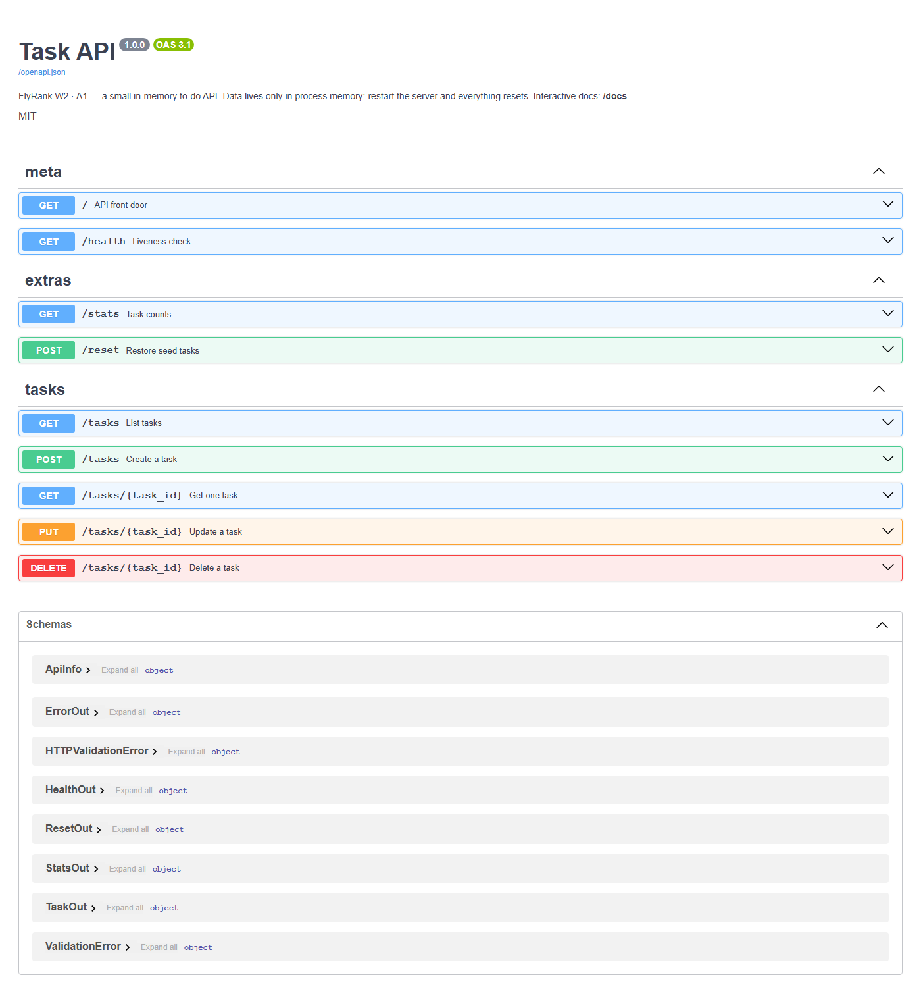

# Task API — FlyRank W2 · A1

A small **in-memory** to-do CRUD API built with **Python + FastAPI**.  
Interactive docs live at `/docs`. Restart the server and the list resets — that is intentional (Week 3 is about databases).

## Run (one command)

```bash
pip install -r requirements.txt && uvicorn main:app --reload --port 8000
```

Then open:

- API: http://localhost:8000/
- Health: http://localhost:8000/health
- Swagger UI: http://localhost:8000/docs

## Endpoints

| Method | Path | Status | Meaning |
|--------|------|--------|---------|
| GET | `/` | 200 | API info |
| GET | `/health` | 200 | Liveness |
| GET | `/tasks` | 200 | List tasks (`?done=`, `?search=`, `?limit=&offset=`) |
| GET | `/tasks/{id}` | 200 / 404 | One task |
| POST | `/tasks` | 201 / 400 | Create (`{"title":"..."}`) |
| PUT | `/tasks/{id}` | 200 / 400 / 404 | Update title and/or done |
| DELETE | `/tasks/{id}` | 204 / 404 | Delete (empty body on success) |
| GET | `/stats` | 200 | `{ total, done, open }` |
| POST | `/reset` | 200 | Restore the 3 seed tasks |

## Example `curl -i` output

```http
HTTP/1.1 201 Created
content-type: application/json

{"id":4,"title":"Buy milk","done":false}
```

Command used:

```bash
curl -i -X POST http://localhost:8000/tasks ^
  -H "Content-Type: application/json" ^
  --data-binary "@create.json"
```

On macOS/Linux use a single line with `-d "{\"title\":\"Buy milk\"}"`.

404 shape (never an empty 200):

```http
HTTP/1.1 404 Not Found
{"error":"Task 99 not found"}
```

## Swagger UI



Use **Try it out** to create → list → update → delete without typing curl.

## Pagination note

`GET /tasks?limit=2&offset=1` returns a page, not “everything”. Real APIs paginate so clients stay fast, payloads stay small, and one slow consumer cannot force the server to serialize an unbounded list.

## The mortality experiment

I created a few tasks, stopped the server, started it again, and `GET /tasks` only showed the three seed tasks. That happened because this API keeps data in a Python list inside the process — when the process dies, the memory is gone. Week 3 exists to replace that RAM shelf with a real database.

## Seed tasks

1. Draft SEO report outline for client onboarding  
2. Review Crawl API response schemas  
3. Ship Week 2 CRUD checkpoint curls  

## Project layout

```
main.py              # submission API (Stages 0–6 + extras)
requirements.txt
README.md
assets/swagger-ui.png
ai-version/          # Stage 7 quarantine — not the submission
```

## AI vs me (Stage 7)

FlyRank allows AI tools. Stage 7 still matters: write a precise prompt, quarantine the output, then review it like a junior PR.

### Prompt used (v1 — from memory)

See [`ai-version/PROMPT_v1.md`](ai-version/PROMPT_v1.md). Full text:

> Build a Python FastAPI to-do API that stores tasks only in a Python list in memory (no database).
>
> Requirements:
> - Run on port 8000
> - GET / returns {"name":"Task API","version":"1.0","endpoints":["/tasks"]}
> - GET /health returns {"status":"ok"}
> - Seed 3 tasks with id, title, done
> - GET /tasks lists all
> - GET /tasks/{id} returns one task or 404 {"error":"Task N not found"}
> - POST /tasks with {"title":"..."} creates with next id, done=false, status 201
> - Missing/empty title on POST → 400 with JSON error
> - PUT /tasks/{id} updates title and/or done; 404 if missing; 400 if body invalid/empty
> - DELETE /tasks/{id} returns 204 empty body, or 404
> - Swagger UI available (FastAPI default /docs)
> - Put everything in one main.py file with requirements.txt
>
> Keep it simple. One file is fine.

First AI output: [`ai-version/main.py`](ai-version/main.py)

### What the AI did better

It used Pydantic models (`TaskCreate`, `TaskUpdate`) so route signatures stay short and Swagger documents the body schema automatically. That is cleaner than my raw `request.json()` parsing for create/update — and I understand it: FastAPI validates the model before the handler runs.

### What it got wrong or quietly ignored

1. **Error shape** — it raised `HTTPException(detail=...)`, so clients get `{"detail": "..."}` instead of the required top-level `{"error": "Task N not found"}`.
2. **Status 422** — missing `title` on POST becomes FastAPI’s default **422**, not assignment **400**.
3. **Empty PUT body** — `TaskUpdate()` with all `None` fields still returns **200** and changes nothing; the prompt asked for **400** on empty/invalid bodies.
4. **Whitespace titles** — `title="   "` can sneak through depending on how strip is applied (create strips in one path inconsistently vs assignment strictness).

### What my prompt forgot (AI decided for me)

I did not specify the exact JSON error key (`error` vs `detail`), did not ban 422, and did not say PUT `{}` must be 400. The AI also picked generic seed titles and left out extras (stats/reset/filter) — fair, I never asked.

### Rematch (one improved prompt)

Improved prompt: [`ai-version/PROMPT_v2.md`](ai-version/PROMPT_v2.md)  
Regenerated code: [`ai-version/main_v2.py`](ai-version/main_v2.py)

**What changed:** spelling out top-level `{"error":...}`, forcing **400 not 422**, and empty PUT → 400 made the rematch match the checkpoint curls far more closely.

Compare:

```bash
git diff --no-index main.py ai-version/main.py
git diff --no-index main.py ai-version/main_v2.py
```

## Commit history

Built stage by stage (`git log --oneline`):

- Stage 0: hello server  
- Stage 1: root and health endpoints  
- Stage 2: read endpoints with 404  
- Stage 3: create with validation  
- Stage 4: full CRUD  
- Stage 5: Swagger UI  
- Extras: filter, search, stats, reset, pagination  
- Stage 6: publish and docs  
- Stage 7: AI vs me  

## License

MIT — learning project for the FlyRank Backend internship.
